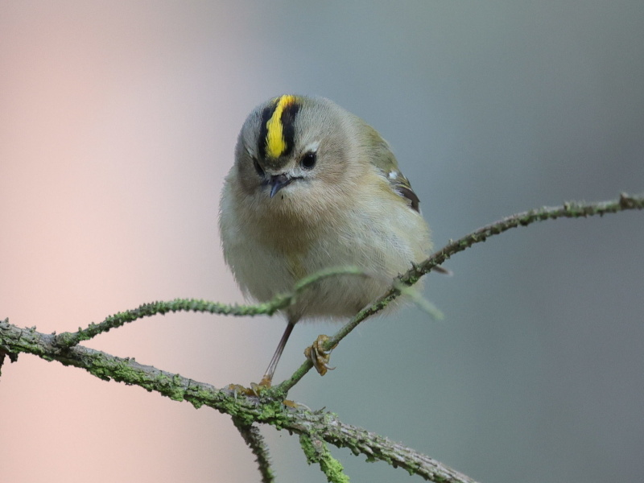

================================================================================
        Tool for recovering Canon CR3 photos from disc dumps
================================================================================

Last update: 2022-01-19

A CLI tool for recovering Canon CR3 photos from memory dumps.

.. contents::

Background
--------------------------------------------------------------------------------

I spent a beautiful day in a forest, capturing cold sunny morning, catching
the goldcrest and hoping to meet the red deer. At home, I copied half of
the pictures from a memory card and suddenly the card became unreadable...
This is how the story of this program begins.

Introduction
--------------------------------------------------------------------------------

It may happen that a memory card cannot be read due to some mysterious
errors, I guess in most cases due to a file system corruption. The card
cannot be used by an operating system nor the camera, but the data on the
card was not erased.

In such a case, the best what we can do in the first place is to create **a
dump** of a memory card. In Linux, it can be done with ``dd`` utility, for
other operating systems similar tools are also available.

Once we backup the exact data dump from a broken card, it's quite safe to
try some dedicated software to recover our data. One of the free software
out there is TestDisk__, but it's worth to make research and maybe considering
some proprietary tools.

Also, if the lost files are valuable, consider some paid services. Even if
there are physical damages to a card (visible or not), it's still a high
chance to recover data. I highly recommend videos from SGdata__ company ---
commentary is in Polish, but we can witness that in a well-equipped lab
a lot of magic can happen, including re-soldering memory chips.

__ https://www.cgsecurity.org/wiki/TestDisk_Download
__ https://www.youtube.com/channel/UCVwaxKNLrHW5y4mj52e0vzw

Tool usage
--------------------------------------------------------------------------------

The tool reads a memory dump, tries to locate CR3 files and extract them
to separate files.

The only assumption is that the files were saved in continues ranges of disc
sectors. If we didn't remove any pictures from the memory card during our photo
sessions, this assumption is very likely to hold, and recovering photos
should be seamless. Even if we removed some, don't panic and give the tool
a try.

In the following examples we assume our card dump is named ``64MB.dump``.

Invocation::

    $ recovercr3 --input 64MB.dump --outdir recovered

Argument ``--input`` points to memory dump, ``--outdir`` is a directory
where recovered files are stored. By default recovered files are named
``img1.cr3``, ``img2.cr3`` and so on.

Here is a sample output from my (real) recovering session::

    [INFO] Processing 64MB.dump
    [INFO] Saving recovered/img1.cr3, size 25,869,910 B
    [INFO] Saving recovered/img2.cr3, size 25,877,078 B
    [INFO] Saving recovered/img3.cr3, size 26,593,878 B
    [INFO] Saving recovered/img4.cr3, size 25,963,606 B
    [INFO] Saving recovered/img5.cr3, size 25,901,654 B
    [INFO] Saving recovered/img6.cr3, size 26,089,558 B
    [INFO] Saving recovered/img7.cr3, size 27,290,198 B
    [INFO] Saving recovered/img8.cr3, size 27,269,718 B
    [INFO] Saving recovered/img9.cr3, size 27,277,910 B
    ...
    [INFO] Saving recovered/img628.cr3, size 27,575,894 B
    [INFO] Saving recovered/img629.cr3, size 27,570,262 B
    [INFO] Saving recovered/img630.cr3, size 27,556,438 B
    [INFO] Saving recovered/img631.cr3, size 27,564,118 B
    [INFO] Restored 636 file(s)

I managed to copy approx one hundred files before card failure. Thanks
to that I was able to compare the recovered files with originals.
They were exactly the same, thus I suppose the tool is quite reliable.

Here's one of the restored photos --- the goldcrest, the smallest bird
that lives in Poland.

Technical details
--------------------------------------------------------------------------------

These are a few technical details that may be helpful if the default settings
fail. First of all, the tool tries to locate a specific file header ---
a few bytes that mark the beginning of the CR3 file.

Once the file's beginning is known, we need to find out its size.
Fortunately, it's quite easy, as CR3 files are sequences of "atoms"
(chunks), where each chunk has a 4-letter name and size. We don't have
to look inside chunks, it's sufficient to read the size.

My Canon R6 produces CR3 files with the following sequences of chunks::

    atom name = b'ftyp', size = 24
    atom name = b'moov', size = 35632
    atom name = b'uuid', size = 65560
    atom name = b'uuid', size = 400456
    atom name = b'free', size = 72
    atom name = b'mdat', size = 24083046

The first chunk has name "ftyp" and last "mdat". And this is the default
setting: once the program reaches "mdat" chunk, it assumes there are
no more chunks.

With the argument ``--lastchunk=name`` we may choose another name of the
terminating chunk. I guess that the name would depend on the camera type.

For example::

    $ recovercr3 --input 64MB.dump --outdir recovered --lastchunk=name

Alternatively, we may force the program to always output a fixed number
of chunks.

For example::

    $ recovercr3 --input 64MB.dump --outdir recovered --maxchunks=7

Pass option ``--verbose`` (or ``-v``) to the program, it will display
details of chunks. If chunk names become crazy and theirs sizes are
also absurdly big, probably they contain garbage.

Please also note that too large files (with extra chunks) may not be
properly opened, even if they contain valid RAW file inside. A sample
too-large file was checked in the following programs:

- Microsoft Photo: **OK**
- Lightroom: can't open
- Photoshop: can't open
- CameraRAW: can't open
- Affinity Photo: **OK**
- Capture One 22: **OK**
- Raw Digger: **OK**

Installation
--------------------------------------------------------------------------------

Program is a standalone `Python 3`__ script, copy ``recovercr3.py`` anywhere
and execute it from command line.

__ https://www.python.org/

Acknowledgements
--------------------------------------------------------------------------------

Thanks to **Piotr Cuch** and **Jakub Kwoliński** for checking a recovered
file in various graphic programs.
